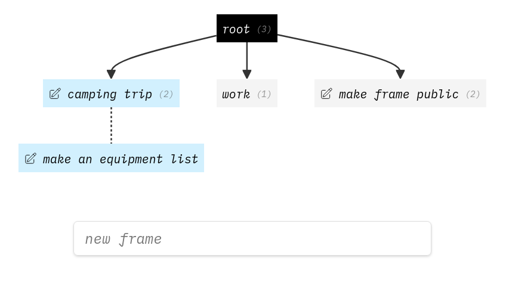
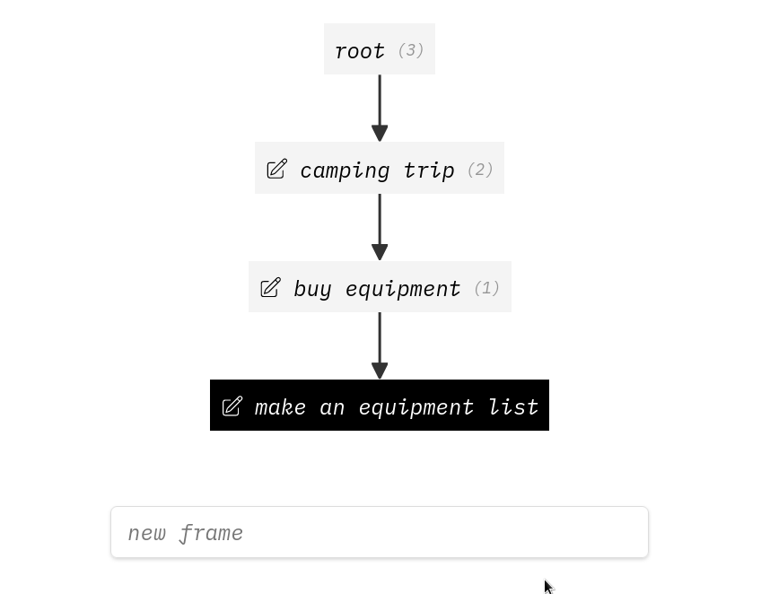
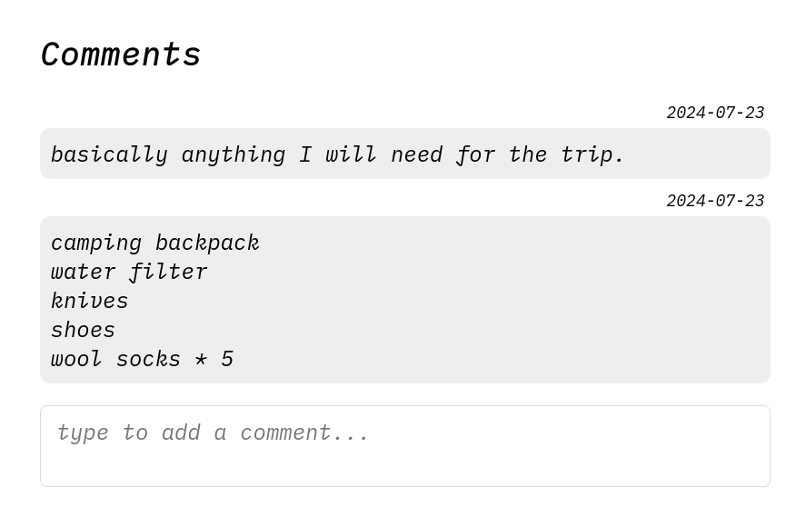
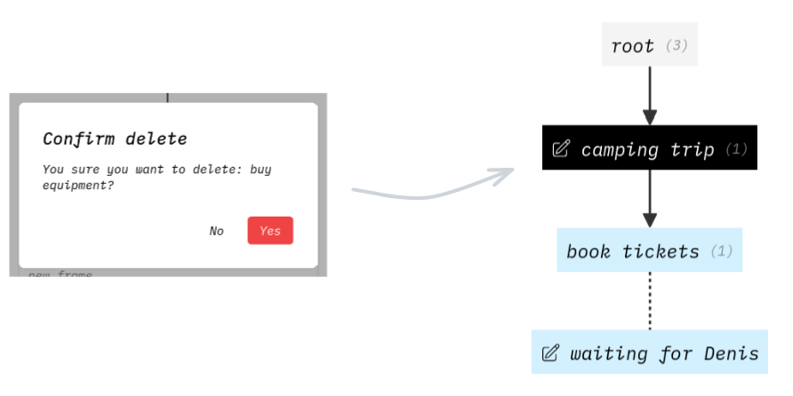
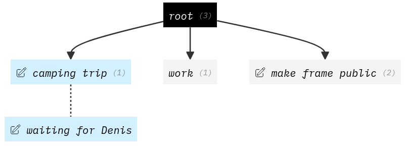
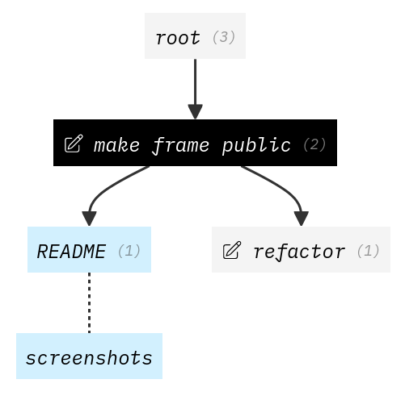

#  frame
> Trees 🌳 that make context switching & planning feel seemless

> [!NOTE]
> This project is [a home-cooked meal](https://tdom.dev/home-cooked).
> A WIP thing for me and only me, which is why the code is likely a mess.

## What is context switching

Focusing on a sigle thing is hard. Most of us have multiple "projects" we work on
concurrently (work stuff, side projects, planning a trip, house maintenance, etc).

These projects all involve multiple steps, often waiting on things outside of your control
(like waiting for your friends to confirm available days off-work) for next steps to become actionable.

I've grown frustrated with trying to juggle these in my head.
Having to remember *"what was I doing here?"* (or what did I want to do next)
when coming back to a project I haven't worked on in 2 weeks felt exhausting.

## Introducing frame

This is where `frame` comes in. Frame is not so different from your familiar note editor of choice that supports nested bullet points,
with the exceptions of the following features:

 - good at managing extremely deep lists (talking depths of 20+)
 - jumping into a "most recent" sub bullet point
 - convenient ✨ extras ✨ (like comments, overviews that make navigation easy, etc)

### Demo

#### Root frame

Notice the **blue** items, indicating that "camping trip" was the most recently open project.
The dotted line below it shows the recursive, most recently active frame within it,
telling us the last thing I was doing for the camping trip was making an equipment list.

You can see multiple things next to each other, meaning that they are concurrent tasks.
Different contexts if you will. They don't depend on each other (but camping trip depends on making the equipment list).

#### Make an equipment list

After clicking on the frame, we see the following:

This tells us a few things:

- before we buy equipment, we must first make an equipment list
- before going on the trip, we need to buy equipment
  - notice the count next to it is `2`, which means there is another concurrent task specified there as well

The little pen icons indicate the note has a **comment**.
Scrolling down a little you can see the comments.

#### Comments

This section allows you to write down any info relevant to the task/frame at hand.
You can use it to include more information about the task, comment on the outcome, external links, whatever works for you.

It's super helpful if the title of the frame is not enough to figure out what a given frame/task is about.

One thing to note is that once a task is done, the comments disappear too.
So any comments you want to keep you should copy to a different place (like a note taking app).
In this case, I knew it ahead of time and should've written the equipment list somewhere else from the beginning.

#### Deleting

When you finish a task, delete it, and frame will take you to the parent task.

#### Context switching

Going back to the home page:

We have a project called "make frame public". That's the thing I am working on now!
While it's not blue, clicking in to it will reveal exactly what I was doing last time I worked on this:

Ah right, screenshots in the README! I know exactly what that means.

And that's the basic use cases covered. There are also other operations, for example
moving frames around, swapping them, renaming, etc.

### Features
- offline first (PWA)!
- easy to access, works on any device (PWA)!

## Credits

Highly inspired by [lelethran's frame](https://github.com/lelanthran/frame), fit for my specific needs and use cases.

